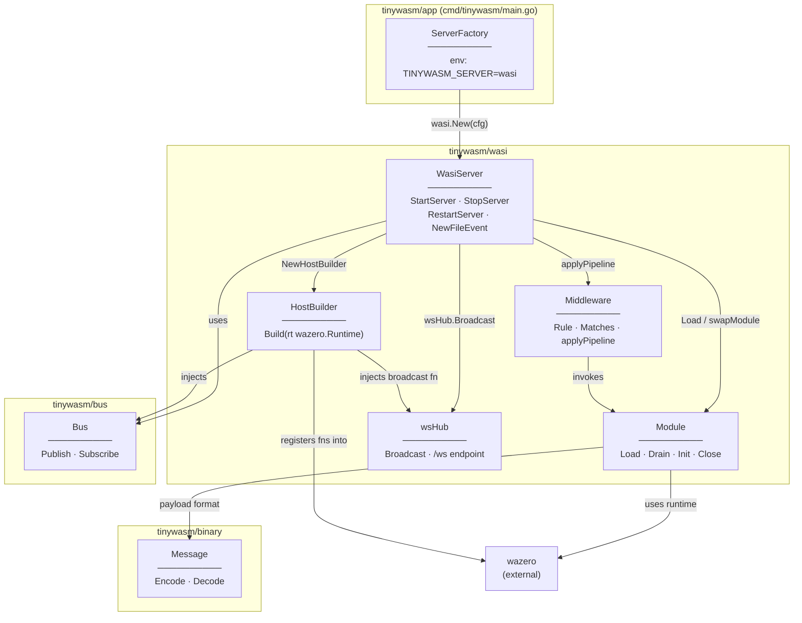
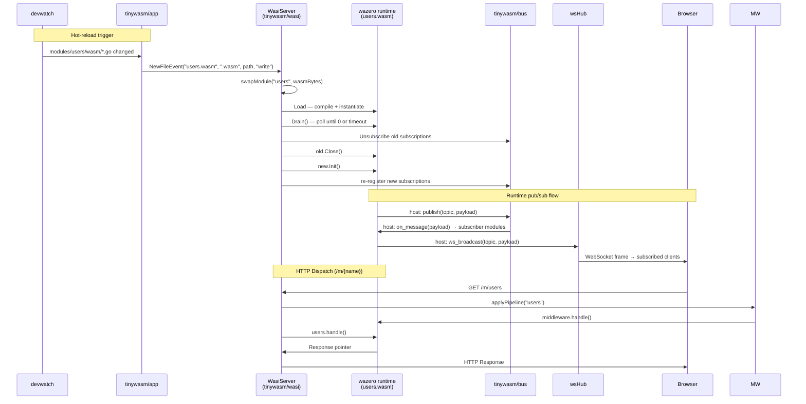

# Architecture — tinywasm/wasi

## Package Dependencies

## Runtime Message Flow

## ServerInterface Boundary

`WasiServer` fully implements `app.ServerInterface` — it is a **drop-in replacement**
for `tinywasm/server.ServerHandler`. Selection is done in `main.go` via env var:

| `TINYWASM_SERVER` | Concrete server used |
|---|---|
| `wasi` | `tinywasm/wasi.WasiServer` |
| *(unset / any)* | `tinywasm/server.ServerHandler` |

| Concerns | File |
|---|---|
| HTTP server, mux, /m/ dispatch, hot-reload | `wasi.go` |
| Middleware routing (rule.txt) & pipeline | `middleware.go` |
| Module load / drain / init / handle | `module.go` |
| Host function builders (pub, sub, ws_broadcast, log) | `host.go` |
| WebSocket HTTP endpoint (`/ws?topic=`) | `ws_hub.go` |
